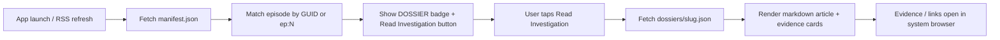

# AI Guide — The Vault Investigation Dossiers

This document is for **AI assistants** (and developers) who need to add, edit, or debug investigation dossiers for **The Vault** Android podcast app.

You do **not** need to ship a new app build to publish dossier content. Changes in this repo go live on GitHub Pages within ~1–3 minutes after push.

---

## Automated workflow (preferred)

**The human only authors content.** RSS GUIDs, `manifest.json`, and `dossiers/*.json` are generated automatically.

### What you edit

```text
content/{episode}-{slug}/
  article.md      ← investigation article (markdown)
  evidence.json   ← array of sources/links
  meta.json       ← optional: title, subtitle, publishedAt, draft
```

Example: `content/11-visa-mafia/`

### What runs automatically

1. **`scripts/build.mjs`** fetches the Spotify/Anchor RSS feed (`build.config.json` → `rssUrl`)
2. Maps **episode number → RSS `<guid>`** (same order as the Android app: newest episode = 1)
3. Writes `dossiers/{slug}.json` and regenerates `manifest.json`
4. **GitHub Action** (`.github/workflows/build-dossiers.yml`) runs on every push to `content/**` and commits the generated files

### AI checklist — add a dossier

- [ ] Copy `content/_template/` → `content/{N}-{slug}/`
- [ ] Write `article.md` and `evidence.json`
- [ ] Set `meta.json` if title/subtitle should differ from RSS (optional)
- [ ] Use `"draft": true` in `meta.json` while work-in-progress
- [ ] **Do not** hand-edit `manifest.json` or `dossiers/`
- [ ] Commit + push `content/` only — CI handles the rest

### Episode number

Match the **EP. XX** pill in the app (newest published episode = 1). The build script prints GUID mappings when it runs.

### Scaffold all episodes from RSS

Every Spotify/Anchor episode gets a pre-filled folder (article + evidence templates):

```powershell
node scripts/scaffold-from-rss.mjs
```

Skips folders that already exist. Regenerates `content/EPISODES.md` index. Runs automatically in CI before build.

### Local build (optional)

```powershell
node scripts/scaffold-from-rss.mjs
node scripts/build.mjs
```

### Publish one episode

1. Edit `content/12-trip-com-exposed/...` (see `EPISODES.md` for folder names)
2. Replace `TODO` in `article.md` and URLs in `evidence.json`
3. Set `"draft": false` in `meta.json`
4. `git push` — only the 3 live dossiers show badges until you flip draft off

---

## What this repo does

| Piece | Role |
|-------|------|
| `content/` | **Source of truth** — you only edit here |
| `scripts/build.mjs` | RSS sync + JSON generator |
| `manifest.json` | **Generated** — episode index for the app |
| `dossiers/{slug}.json` | **Generated** — full micro-blog per episode |
| `.nojekyll` | **Required** — without it, GitHub Pages may break raw JSON URLs |

**Live base URL:** `https://naas1201.github.io/thevault-content/`

**App config** (already wired in the Android project):

```json
"contentManifestUrl": "https://naas1201.github.io/thevault-content/manifest.json",
"contentBaseUrl": "https://naas1201.github.io/thevault-content/dossiers/"
```

---

## How the app loads content



**Matching priority** (see `app.js` → `resolveDossierEntry`):

1. RSS `<guid>` from Anchor (stored as `ep.id` in the app)
2. Fallback: `ep:{number}` shorthand from manifest (e.g. `ep:11`)

**Caching:** Manifest and dossier JSON are cached on-device under `episodes/content/`. The app always tries the network first, then falls back to cache.

**When content updates:** App reloads manifest on launch and when the user refreshes episodes (pull-to-refresh / “check for new episodes”).

---

## Quick checklist — add a new dossier (manual legacy)

> **Use the automated workflow above instead.** This section is for debugging or emergency hand-edits only.

- [ ] Pick a **kebab-case slug** (e.g. `visa-mafia`)
- [ ] Create `content/{ep}-{slug}/` with `article.md` + `evidence.json`
- [ ] Run `node scripts/build.mjs` or push and let GitHub Actions rebuild
- [ ] Verify URLs return JSON (not HTML 404)

---

## Step 1 — Find the episode ID

Each manifest key must match how the app identifies the episode.

### Option A: RSS GUID (preferred)

Fetch the podcast RSS:

```text
https://anchor.fm/s/1103ad32c/podcast/rss
```

Each `<item>` has a `<guid>`. Use that exact string as the manifest key.

Example:

```json
"96ff1e45-1672-4570-b6c4-2fb6b5b76cab": {
  "slug": "french-public-neutrality",
  "hasDossier": true
}
```

### Option B: Episode number shorthand

Use when you know the episode number but not the GUID:

```json
"ep:11": {
  "slug": "visa-mafia",
  "hasDossier": true
}
```

The app checks GUID first, then `ep:{number}`. You may include **both** keys pointing at the same slug (see existing manifest).

### Known episode GUIDs (The Vault)

| Ep # | GUID | Slug (if any) |
|------|------|---------------|
| 1 | `b493574f-c0d6-47ea-8353-b3a743043f0b` | france-media-shell-game (placeholder, `hasDossier: false`) |
| 2 | `96ff1e45-1672-4570-b6c4-2fb6b5b76cab` | french-public-neutrality ✓ |
| 3 | `0dfe1ac1-e6eb-4af8-8b6a-08d76df59f70` | host-producer-grift ✓ |
| 11 | `f9435c4a-f9c1-438e-b574-f681e89cd3b8` | visa-mafia ✓ |

For episodes not listed, read the RSS feed — do not guess GUIDs.

---

## Step 2 — Create the dossier file

**Path:** `dossiers/{slug}.json`

**Filename rules:**

- Lowercase kebab-case only: `my-investigation-name.json`
- Must match `"slug"` inside the JSON and `"slug"` in manifest
- One dossier file per slug; multiple episodes can point to the same slug if intentional

### Full schema

```json
{
  "version": 1,
  "slug": "kebab-case-id",
  "title": "Display title",
  "subtitle": "One-line hook shown under the title",
  "publishedAt": "YYYY-MM-DD",
  "article": {
    "format": "markdown",
    "body": "## Section\n\nArticle text..."
  },
  "evidence": [
    {
      "id": "unique-evidence-id",
      "type": "document",
      "title": "Short label",
      "description": "Optional context shown on the card",
      "url": "https://real-url.example/path",
      "thumbnail": "https://optional-image-url",
      "source": "Optional publisher name",
      "date": "YYYY-MM-DD",
      "tags": ["primary-source", "analysis"]
    }
  ]
}
```

### Field reference

| Field | Required | Notes |
|-------|----------|-------|
| `version` | yes | Always `1` for now |
| `slug` | yes | Must match filename (without `.json`) |
| `title` | yes | Shown in dossier header |
| `subtitle` | no | Secondary line under title |
| `publishedAt` | no | Shown as formatted date |
| `article.format` | yes | Use `"markdown"` (only format fully supported) |
| `article.body` | yes | Markdown string; see supported syntax below |
| `evidence` | no | Array; empty array → “No evidence items published yet.” |
| `evidence[].id` | recommended | Stable ID for your own tracking |
| `evidence[].type` | yes | `document`, `image`, `link`, `video`, or `audio` (controls icon) |
| `evidence[].title` | yes | Card headline |
| `evidence[].url` | yes for tappable cards | Opens in system browser via `Android.openExternalUrl` |
| `evidence[].tags` | no | Displayed as small labels on the card |

### Article markdown — supported subset

The app uses a **lightweight** renderer, not full CommonMark. Stick to:

| Syntax | Supported |
|--------|-----------|
| `## Heading` / `### Heading` | yes |
| `# Heading` | yes (rendered as h2) |
| Paragraphs (blank line separated) | yes |
| `**bold**` | yes |
| `[text](https://url)` | yes (opens externally) |
| `- item` or `* item` bullets | yes |
| `1. item` numbered lists | yes (rendered as bullets) |
| `> blockquote` | yes |
| Code blocks, tables, images inline | **no** |
| HTML in body | escaped — do not rely on it |

Put long URLs in evidence cards, not inline in the article, when possible.

### Evidence best practices

- Use **real, stable URLs** — placeholder domains (`example.com`, `via.placeholder.com`) are fine for demos only
- PDFs and documents: use direct `https://` links the browser can open
- `type: "document"` → document icon; `type: "link"` → link icon; etc.
- Tag primary sources with `"primary-source"` for consistency with existing dossiers

---

## Step 3 — Update manifest.json

Add or update an entry under `"episodes"`:

```json
{
  "version": 1,
  "updatedAt": "2026-06-21T12:00:00Z",
  "contentBaseUrl": "https://naas1201.github.io/thevault-content/dossiers/",
  "episodes": {
    "RSS_GUID_HERE": {
      "slug": "my-new-slug",
      "hasDossier": true
    }
  }
}
```

| `hasDossier` | Effect |
|--------------|--------|
| `true` | DOSSIER badge on tile, “Read Investigation” on detail screen |
| `false` | Entry reserved for future content; no UI affordance |
| omitted with slug | Treated as `true` if slug is present |

**Important:** `slug` in manifest must match `dossiers/{slug}.json` on disk.

---

## Step 4 — Commit and push

From the repo root:

```powershell
git add dossiers/my-new-slug.json manifest.json
git commit -m "Add dossier: my-new-slug"
git push origin main
```

GitHub Pages deploys from `main` / root. No build step.

---

## Step 5 — Verify deployment

Open these URLs in a browser (must return **JSON**, not 404 HTML):

```text
https://naas1201.github.io/thevault-content/manifest.json
https://naas1201.github.io/thevault-content/dossiers/my-new-slug.json
```

Quick terminal check:

```powershell
curl.exe -s -o NUL -w "%{http_code}" "https://naas1201.github.io/thevault-content/manifest.json"
```

Expect `200`.

**On device:** Open the app → refresh episodes → find the episode → confirm DOSSIER badge → tap **Read Investigation**.

---

## Edit or remove a dossier

### Update article / evidence

1. Edit `dossiers/{slug}.json`
2. Bump `updatedAt` in `manifest.json`
3. Push to `main`

Users with cached copies still see old content until the app refetches (launch or RSS refresh). There is no cache-busting query param today.

### Hide dossier without deleting file

Set `"hasDossier": false` in manifest (or remove the episode entry). The JSON file can stay in the repo for later.

### Rename a slug

1. Rename `dossiers/old-slug.json` → `dossiers/new-slug.json`
2. Update `"slug"` inside the JSON
3. Update all manifest entries pointing at the old slug
4. Push — old URL will 404

---

## Common mistakes (avoid these)

| Mistake | Symptom |
|---------|---------|
| Slug mismatch (manifest vs filename vs JSON `slug`) | “Could not load investigation” in app |
| Wrong RSS GUID | No DOSSIER badge; button hidden |
| Invalid JSON (trailing comma, unescaped quotes in body) | 500 or parse error; app shows error state |
| Missing `.nojekyll` | JSON URLs may fail on GitHub Pages |
| Forgetting to push to `main` | Changes not live |
| Using unsupported markdown (tables, images in body) | Broken or plain-text layout |
| `contentBaseUrl` typo | Dossier fetch fails even if manifest works |

---

## Repo layout reference

```text
thevault-content/
├── .nojekyll              # keep this
├── manifest.json          # episode index
├── dossiers/
│   ├── french-public-neutrality.json
│   ├── host-producer-grift.json
│   └── visa-mafia.json
├── guide.md               # this file
├── README.md              # human-oriented overview
├── APP_CONFIG.snippet.json
└── index.html             # optional landing page for humans
```

---

## Android app integration (reference)

Implementation lives in the **TheVault** repo, not here. Relevant paths:

| File | What it does |
|------|----------------|
| `app/src/main/assets/config.json` | `contentManifestUrl`, `contentBaseUrl` |
| `app/src/main/assets/app.js` | `loadContentManifest`, `fetchDossier`, `openDossier`, markdown render |
| `app/src/main/assets/index.html` | Dossier overlay UI, “Read Investigation” button |
| `app/src/main/assets/styles.css` | Dossier overlay + evidence card styles |
| `app/src/main/java/.../Bridge.kt` | `saveCachedContent`, `getCachedContent`, `openExternalUrl` |

**Do not change the app** for routine content publishes. Only touch the app if you need new fields, UI, or markdown features.

---

## Template — minimal new dossier

```json
{
  "version": 1,
  "slug": "REPLACE-WITH-SLUG",
  "title": "Investigation Title",
  "subtitle": "One sentence hook",
  "publishedAt": "2026-06-21",
  "article": {
    "format": "markdown",
    "body": "## Executive summary\n\nBrief overview.\n\n## Key findings\n\n1. **First finding.** Supporting sentence.\n2. **Second finding.** Supporting sentence.\n\n## Method note\n\nHow sources were verified."
  },
  "evidence": [
    {
      "id": "ev-1",
      "type": "link",
      "title": "Primary source",
      "description": "Why this source matters",
      "url": "https://example.org/source",
      "source": "Publisher name",
      "date": "2026-01-01",
      "tags": ["primary-source"]
    }
  ]
}
```

---

## AI workflow summary

When a user asks you to “add a dossier for episode X”:

1. Read this guide and copy `content/_template/` to `content/{X}-{slug}/`
2. Write `article.md` and `evidence.json` — **do not** hand-build `manifest.json`
3. Optionally set `meta.json` (title override, `draft: true` while WIP)
4. Commit and push `content/` — GitHub Actions runs `scripts/build.mjs`
5. Verify manifest + dossier URLs return HTTP 200 after CI completes
6. Tell the user which EP number will show the DOSSIER badge; no app rebuild required

When a user asks to “fix dossier not showing”:

1. Confirm manifest entry exists with `hasDossier: true`
2. Confirm GUID matches RSS (fetch feed, compare `<guid>`)
3. Confirm slug matches filename and live URL
4. Confirm GitHub Pages serves JSON (not 404)
5. Remind user to refresh episodes in the app

---

## Related links

- Repo: `https://github.com/naas1201/thevault-content`
- Manifest: `https://naas1201.github.io/thevault-content/manifest.json`
- Podcast RSS: `https://anchor.fm/s/1103ad32c/podcast/rss`